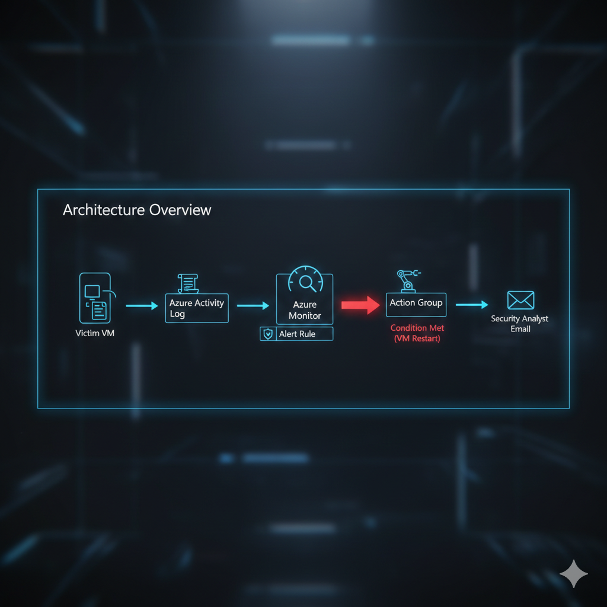
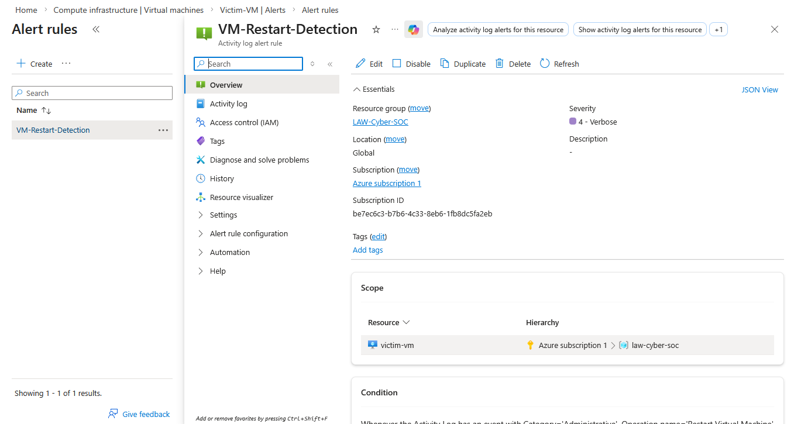
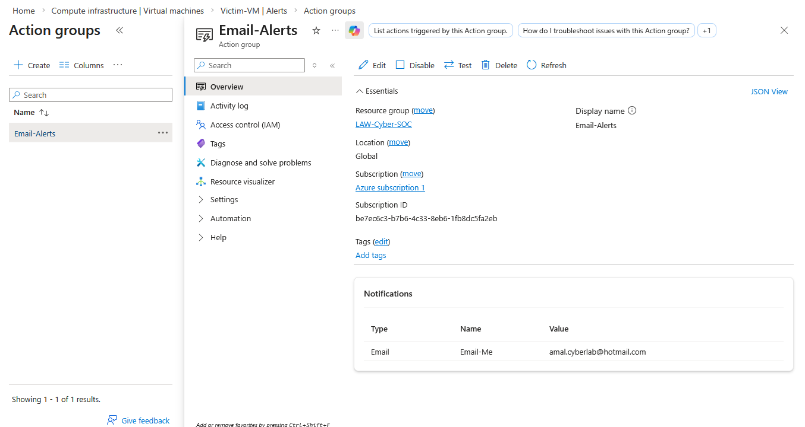
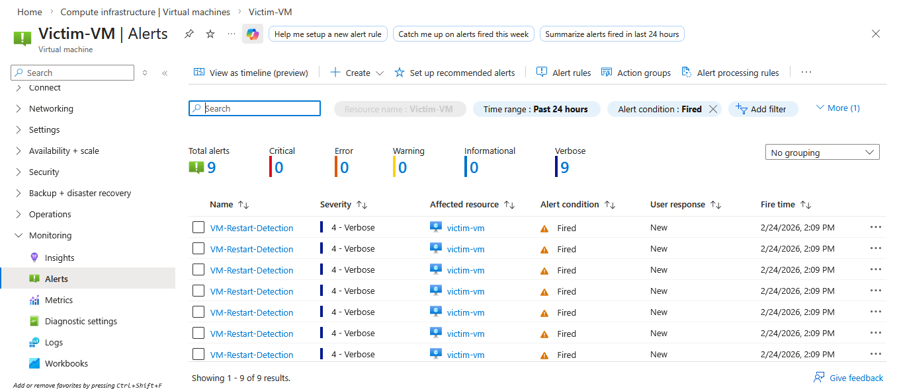
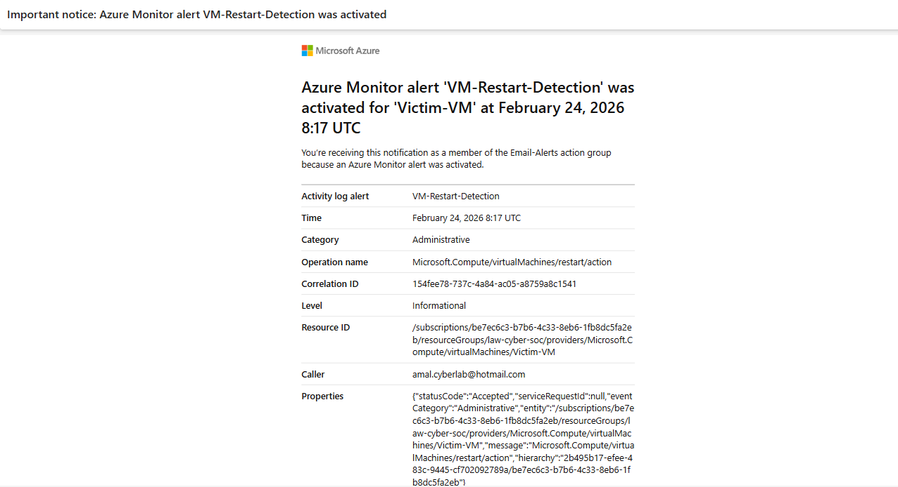

# 🛡️ Azure SOC Monitoring & Incident Alerting Lab

## 📌 Project Overview
In this hands-on lab, I established a cloud-based security monitoring system using **Microsoft Azure**. The primary objective was to simulate a Security Operations Center (SOC) workflow by configuring real-time alerts for critical system events. 

I successfully configured an alerting mechanism that monitors for **Virtual Machine restarts**, ensuring that any potential unauthorized access or system instability is instantly reported to a security analyst.

---

## 🏛️ Architecture Overview

The monitoring pipeline follows a structured flow to ensure zero-latency incident detection, as illustrated below:

1. **Event Source:** An administrative action (e.g., VM Restart) occurs on the **Victim-VM**.
2. **Logging:** The event is captured and stored in the **Azure Activity Log**.
3. **Detection:** **Azure Monitor** continuously evaluates the Activity Log against a pre-defined **Alert Rule** for specific signals.
4. **Action:** Upon a positive match of the alert condition, the configured **Action Group** is triggered.
5. **Notification:** The Action Group executes the configured action, dispatching a real-time notification to the **Security Analyst's Email**.

---

## 🛠️ Tech Stack & Tools
* **Cloud Platform:** Microsoft Azure
* **Monitoring:** Azure Monitor & Activity Logs
* **Automation:** Azure Action Groups
* **Target System:** Ubuntu Linux Virtual Machine

---

## 🚀 Implementation & Configuration

### 1. Alert Rule Logic
I defined a custom signal logic to detect whenever the `Microsoft.Compute/virtualMachines/restart/action` event occurs.

### 2. Action Group & Notification
Configured an Action Group to automate the notification process via email.

---

## 📊 Lab Results

### ✅ Incident Dashboard
The Azure Monitor dashboard successfully captured multiple alert instances following the manual triggers.

### ✅ Real-time Email Proof
This is the automated email alert received immediately after the incident was detected.

---

## 🛡️ Security Significance
* **Visibility:** 24/7 monitoring of critical infrastructure changes.
* **MTTD:** Significantly reduces the Mean Time to Detect incidents.
* **Compliance:** Maintains a clear audit trail for security investigations.

---

## 📝 Conclusion
This lab demonstrates how to leverage cloud-native tools to build a proactive security monitoring solution, a vital skill for any SOC Analyst or Cloud Security Engineer.

---
**Author:** Amal Udayanga Basnayake

**LinkedIn:** https://www.linkedin.com/in/amal-udayanga-basnayake/

**GitHub:** https://github.com/AmalUBasnayake
